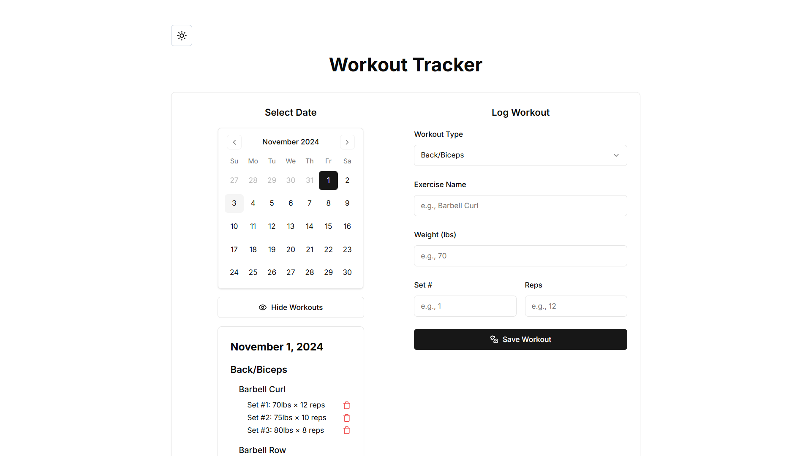

# Workout Logs App LocalStorage Version

A minimalist and user-friendly workout tracker application built with Next.js and styled using shadcn UI components. This app allows users to log their daily workouts, including both cardio and strength training exercises, and track their progress over time. This version is using LocalStorage for demonstration purposes.

## Table of Contents

- [Features](#features)
- [Screenshots](#screenshots)
- [Technologies Used](#technologies-used)
- [Getting Started](#getting-started)
- [Prerequisites](#prerequisites)
- [Installation](#installation)
- [Usage](#usage)
- [Contributing](#contributing)
- [License](#license)

## Features

- **Workout Logging**: Add workouts for specific dates, including exercise name, workout type, duration, weight, sets, and reps.
- **Workout Display**: View workouts logged for a specific date in a clean and organized format.
- **Dark Mode Support**: Toggle between light and dark themes for comfortable viewing.
- **Responsive Design**: Optimized for both desktop and mobile devices.
- **Minimalist UI**: Clean and intuitive user interface with a focus on simplicity.
- **Toast Notifications**: Provides immediate feedback on actions like adding or deleting workouts.

## Screenshot



## Technologies Used

- **Next.js**: A React framework for server-side rendering and generating static websites.
- **TypeScript**: Adds static typing to JavaScript to improve developer experience and code reliability.
- **shadcn UI**: A component library built on top of Tailwind CSS, providing pre-built components and utilities.
- **Tailwind CSS**: A utility-first CSS framework for rapidly building custom designs.
- **Radix UI**: Unstyled, accessible components for building high-quality design systems and web apps.
- **Lucide React**: A collection of simply beautiful open-source icons for React.
- **next-themes**: A plugin to help manage themes in Next.js applications.
- **Date-fns**: A modern JavaScript date utility library for parsing, formatting, and manipulating dates.
- **Class Variance Authority (CVA)**: For managing complex styling with variants in React components.

## Getting Started

### Prerequisites

Make sure you have the following installed on your machine:

- Node.js (version 14 or higher)
- npm or yarn

### Installation

Clone the repository:

```bash
git clone https://github.com/yourusername/workout-tracker.git
cd workout-tracker
```

Install dependencies:

```
npm install
```

Run the development server:

```
npm run dev
```

Open the app in your browser:

Navigate to http://localhost:3000 to view the app.

### Usage

1. Add a Workout:

**Select a Date: Choose the date for your workout using the date picker.**

**Choose Workout Type: Select either "Cardio" or "Back/Biceps" or any of the options from the dropdown.**

**Enter Exercise Details:**

- **_Exercise Name:_** Enter the name of the exercise (e.g., Bench Press, Running).
- **_Duration:_** Enter the duration in minutes.
- **_Weight:_** Enter the weight used in pounds.
- **_Set Number:_** Enter the set number.
- **_Reps:_** Enter the number of repetitions.
- **_Save Workout:_** Click the Save Workout button to log your workout.

2. View Workouts:

- **_Toggle Visibility:_** Click on the View Workouts button to display or hide the workouts for the selected date.
- **_Workout Display:_** Workouts are grouped by type and exercise for easy navigation.
- **_Delete Workouts:_** Click the trash icon next to a workout to delete it.

3. Toggle Theme:

- Use the theme toggle button in the navbar to switch between light and dark modes.

### Contributing

Contributions are welcome! If you'd like to contribute, please follow these steps:

1. Fork the project.

2. Create your feature branch:

```bash
git checkout -b feature/YourFeature
```

3. Commit your changes:

```bash
git commit -m 'Add some feature'
```

4. Push to the branch:

```bash
git push origin feature/YourFeature
```

5. Open a pull request.

### License

This project is licensed under the MIT License - see the LICENSE file for details.
